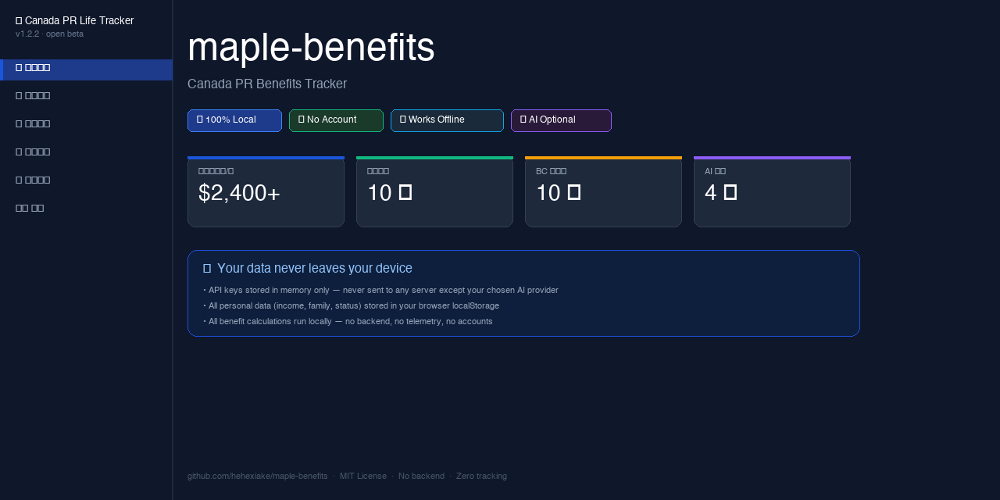

# maple-benefits

**Canada PR Life Tracker** — A free, open-source tool for new Canadian permanent residents to discover, calculate, and track federal and provincial benefits.

🇨🇦 [**Try it now → hehexiake.github.io/maple-benefits**](https://hehexiake.github.io/maple-benefits)

---

## 🔒 Your data never leaves your device

Unlike other platforms that require you to create an account or upload personal information to their servers, everything in maple-benefits stays on **your device**:

| What | Where it lives |
|------|---------------|
| Your profile (income, family, status) | Browser `localStorage` — your device only |
| Benefit calculations | Runs entirely in your browser — no backend |
| AI API keys | Memory only — never stored on any server |
| AI analysis results | Sent only to the AI provider you choose (OpenAI / Google / Anthropic) — not to us |
| Usage tracking | None. Zero telemetry. |

You can verify this yourself: the entire app is a single `index.html` file. Open it offline and everything works except AI features. There is no server to send your data to.

---

## What it does

If you recently got your Canadian PR, you're eligible for benefits worth thousands of dollars per year — but they're spread across federal and provincial programs with different eligibility rules, income thresholds, and deadlines.

This tool helps you:

- **Calculate** how much you can actually receive (not just "you might be eligible")
- **Track** your application status across 20 federal and BC benefits
- **Get alerted** about policy changes, deadlines, and likely missed benefits
- **Use AI** to scan your city for local programs and get personalized strategy

---

## Why this is different

| | maple-benefits | canada.ca Benefits Finder | CRA Calculator | Benefits Wayfinder |
|--|--|--|--|--|
| Calculates dollar amounts | ✅ | ❌ | Partial | ❌ |
| Covers federal + provincial | ✅ | Partial | ❌ | ✅ |
| AI-powered local benefit scan | ✅ | ❌ | ❌ | ❌ |
| Works offline, zero backend | ✅ | ❌ | ❌ | ❌ |
| No account required | ✅ | ✅ | ✅ | ❌ |
| Your data stays local | ✅ | ❌ | ❌ | ❌ |
| Open source | ✅ | ❌ | ❌ | ❌ |

---

## How to use

**Option 1 — Web (recommended)**
Open [hehexiake.github.io/maple-benefits](https://hehexiake.github.io/maple-benefits) in any browser. No install, no account, no sign-up.

**Option 2 — Fully offline**
Download `index.html`, double-click to open. Works 100% offline. AI features require an API key but the rest of the app is fully functional without internet.

---

## AI features

AI is **optional**. The core benefit calculator, tracker, and alerts work completely without it.

If you want AI features, you provide your own API key (OpenAI, Google Gemini, or Anthropic Claude). The key is stored **in memory only** for the current browser session — it is never written to disk, never sent to any server other than the AI provider you choose, and disappears when you close the tab.

With AI you unlock:
- **City benefit scan** — finds municipal and community programs in your city
- **Gap check** — finds benefits you likely qualify for but haven't applied to
- **Cross-benefit optimization** — analyzes how RRSP/FHSA contributions affect your total benefit income
- **Scenario diagnosis** — action plans for life events (new baby, divorce, job loss, buying a home)

---

## Data coverage

| Scope | Status |
|-------|--------|
| Federal (10 benefits) | ✅ Complete, verified 2025-26 |
| British Columbia (10 benefits) | ✅ Complete, verified 2025-26 |
| Ontario | 🚧 Coming soon |
| Other provinces | 🚧 Contributions welcome |

Data is updated annually to align with Canada's benefit year (July–June).

---

## Contributing

We especially need help with **provincial data**. If you live in Ontario, Alberta, Quebec, or another province, you can contribute benefit data without writing any code — just fill in a JSON template.

See [CONTRIBUTING.md](CONTRIBUTING.md) for details.

---

## Disclaimer

This tool is for informational purposes only. Benefit amounts are estimates based on publicly available CRA and provincial government data. This is not tax or legal advice. Always verify with official sources before making financial decisions.

---

## License

MIT — free to use, modify, and distribute. See [LICENSE](LICENSE).
